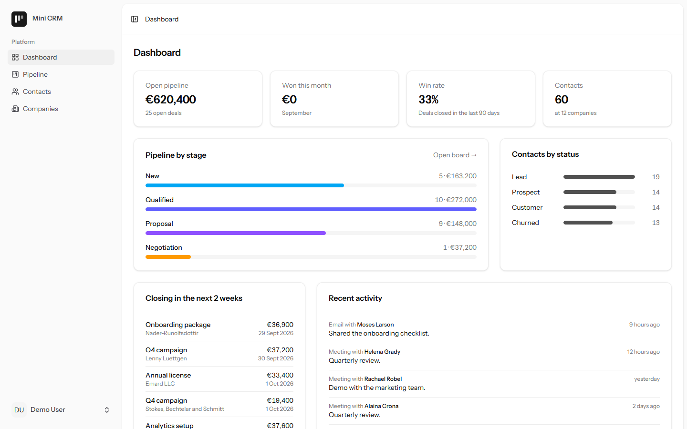
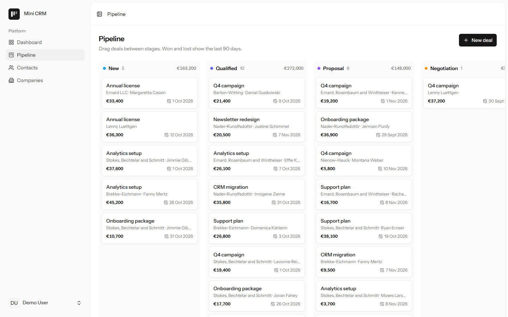
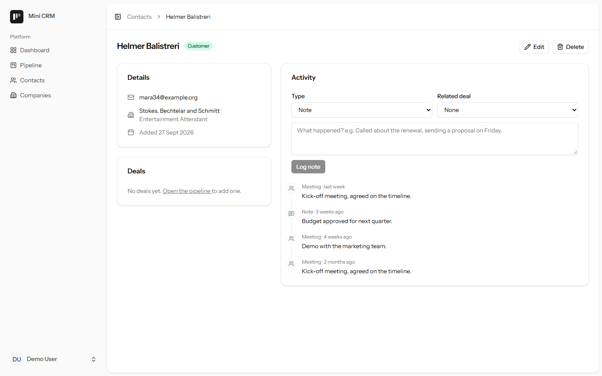

# Mini CRM

A small CRM for a sales team of one: contacts, companies, a drag-and-drop deal pipeline, an activity log per contact, and CSV import from whatever tool you used before.

Built with **Laravel 13**, **Inertia 3**, **Vue 3 + TypeScript** and **Tailwind 4**, starting from the official Laravel Vue starter kit (auth, settings and the UI kit come from there; everything under "What's in it" is this project).



## What's in it

- **Pipeline board.** Deals in six stages, dragged between columns with the order saved. Moving a deal to Won or Lost stamps `closed_at`; moving it back clears it. Won and lost columns only show the last 90 days so the board stays usable.
- **Contacts and companies.** Search across first name, last name, "first last", email and company name; filter by status and company; sort by name or date.
- **Activity log.** Calls, emails, meetings and notes on a contact's page, optionally tied to one of their deals.
- **CSV import** as a queued job. Rows with problems are reported by line number and skipped, never failing the whole file. It copes with what real exports look like: a UTF-8 BOM, semicolon separators (Excel in most of Europe), and headers like "First Name", "Surname" or "E-mail". Companies are matched by name, case-insensitively, or created.
- **Dashboard.** Open pipeline, revenue won this month, win rate over 90 days, and deals due in the next two weeks.

| Pipeline | Contact |
| --- | --- |
|  |  |

## Decisions worth pointing out

**Each user only sees their own data, and can't find out what else exists.** Every table has a `user_id`. Policies (`app/Policies/OwnedByUser.php`) return **404** rather than 403 for someone else's record, so ids can't be probed. Tests cover this for every controller.

**Foreign keys in requests are checked for ownership, not just existence.** A plain `exists:companies,id` rule would let a user attach a contact to another account's company by guessing its id (IDOR). `CrmRequest::owned()` scopes the check to the current user. The same applies to deals → contacts and activities → deals.

**Money is stored in cents** (`value_cents`, integer) so sums never drift. The form takes euros and the request converts once, in `DealRequest::dealAttributes()`.

**Board order is kept consistent on the server.** `App\Actions\Deals\DealBoard` renumbers positions to `0..n-1` inside a transaction on every move, re-stage and delete, so the order never drifts no matter what order requests arrive in. The Vue board updates optimistically and falls back to the server's state if the request fails.

**N+1 queries fail loudly.** `Model::preventLazyLoading()` is on outside production, so a missing `with()` throws in development and in tests instead of quietly slowing pages down.

**Search is portable.** Matching "maria pap" to Maria Papadopoulou is done per column instead of with `first_name || ' ' || last_name`, because `||` means string concatenation in SQLite but OR in MySQL. `%` and `_` in the search box are escaped.

## Running it

Requires PHP 8.3+, Composer and Node 22.

```bash
composer setup          # install, .env, key, migrate, build
php artisan db:seed     # demo data
composer dev            # app, queue worker, logs and Vite together
```

Then open http://localhost:8000 and sign in as **demo@example.com / password**.

The CSV import runs on the queue, so it needs the worker that `composer dev` starts. Drag and drop uses the HTML5 API, which touch screens don't support; on a phone, tap a deal and change its stage in the form.

## Tests and checks

```bash
composer ci:check   # what CI runs: lint + format, vue-tsc, Pint, PHPStan (level 7), PHPUnit
php artisan test    # just the tests
```

The CRM features are covered by feature tests in `tests/Feature/Crm` and `tests/Feature/DashboardTest.php`: ownership and 404s, IDOR attempts, validation, search, board ordering after moves and deletes, and the import (bad rows, duplicates, Excel-style files, missing columns, file cleanup).
